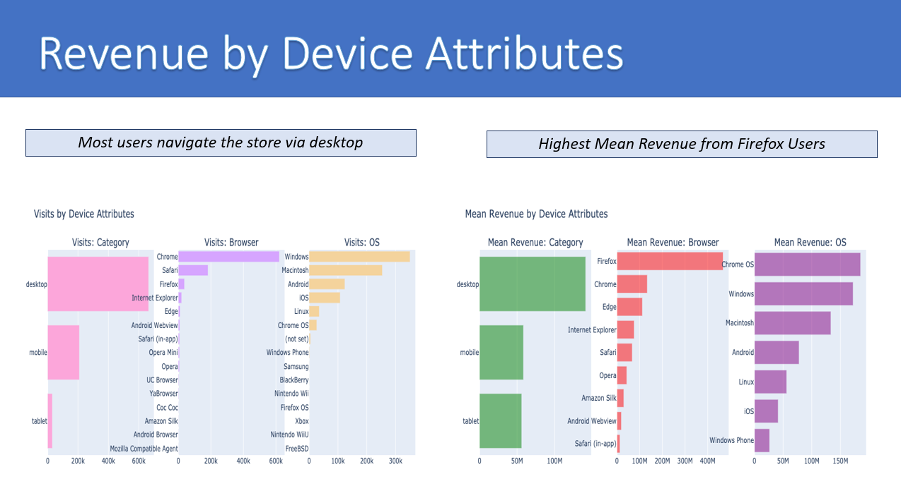

# Google-Merchandise-Store
Google Merchandise Store Analysis and Prediction in Pyhton

# Jupiter notebook:
https://github.com/trajceskijovan/Google-Merchandise-Store/blob/main/Google%20Merchandise%20Store.ipynb

# Presentation (deck): 
https://github.com/trajceskijovan/Google-Merchandise-Store/blob/main/Google%20Merchandise%20Store%20Deck.pdf

# Analytics Insight:

